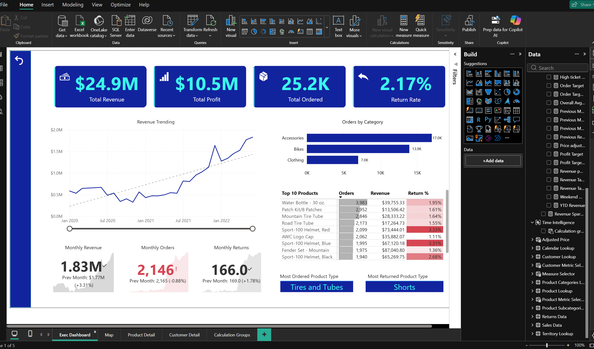
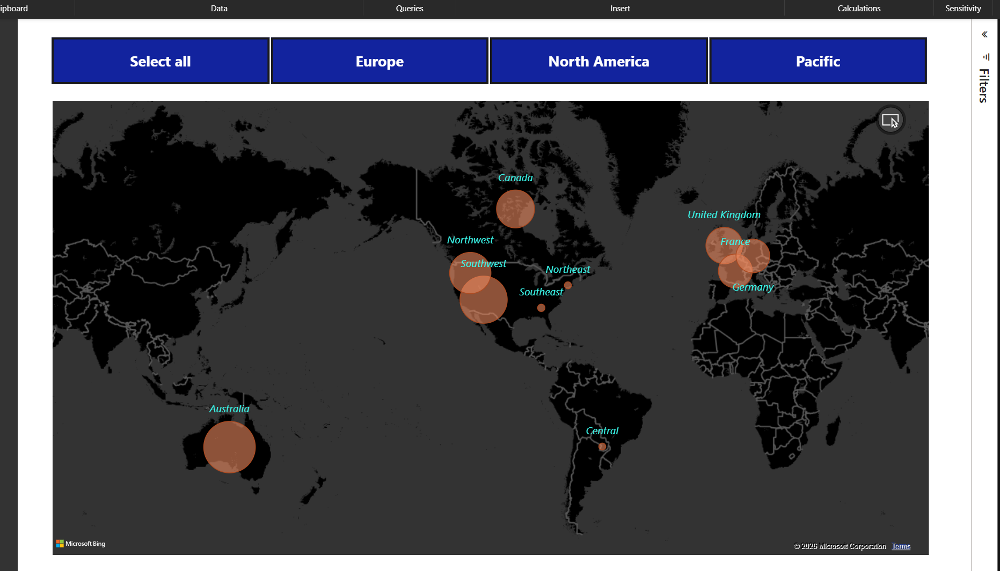
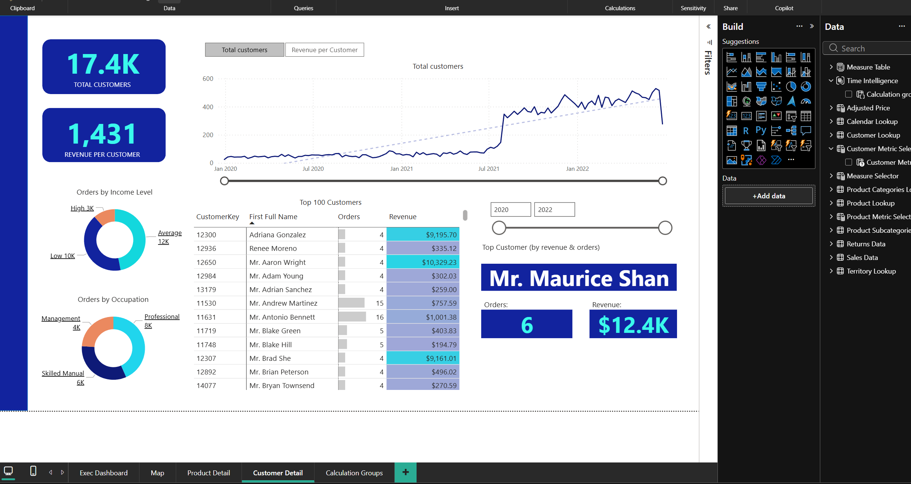
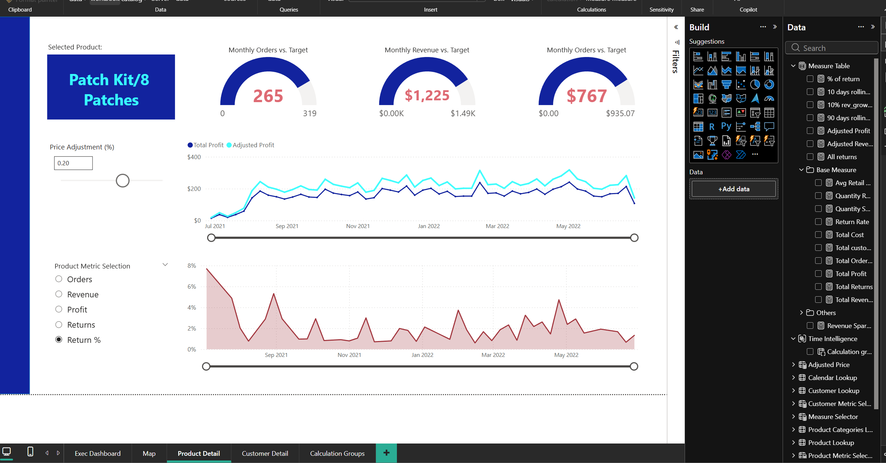
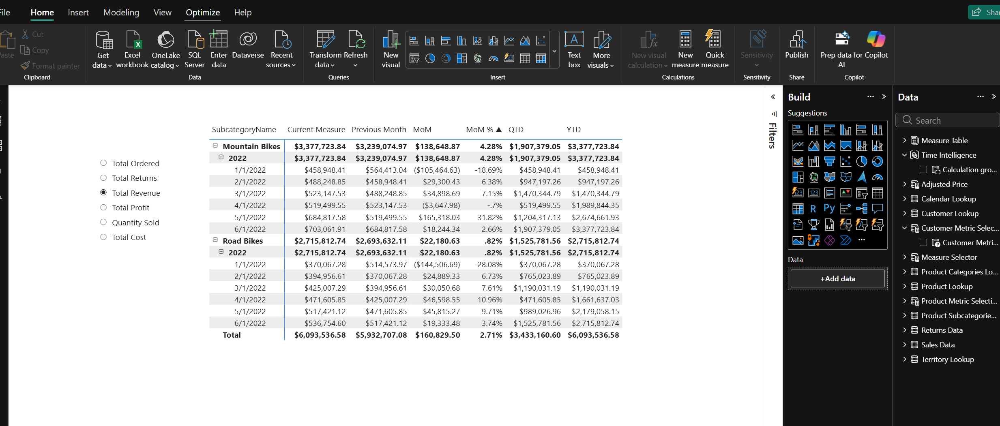

# Power BI Sales Dashboard - AdventureWorks Project

Interactive sales performance dashboard built from scratch as part of the Maven Analytics "Microsoft Power BI Desktop for Business Intelligence" course on Udemy.

## Project Overview
This dashboard analyzes sales, customer, product, and territorial data from the AdventureWorks dataset. It provides stakeholder-ready insights through multi-page interactivity, advanced DAX, and dynamic features.

### Key Features & Skills Applied
- Data transformation with Power Query (cleaning, blending)
- Star schema data modeling (relationships, hierarchies)
- Advanced DAX: CALCULATE, iterators (SUMX etc.), explicit measures/columns, time intelligence (YoY/MoM/YTD)
- Custom visualizations (maps, gauges, tables with conditional formatting)
- Interactivity (slicers, drill-throughs, bookmarks)
- Numeric & field parameters (what-if analysis, dynamic measure switching)
- Calculation groups for optimized reporting

## Screenshots

## How to View
- Download the `.pbix` file and open in Power BI Desktop (free).
- Or view the exported PDF for a static overview.

## About
Completed January 2026 | Aspiring Data Analyst pivoting from Mechanical Engineering/MBA background.

LinkedIn Post: [(https://www.linkedin.com/posts/rajan-karki-rk9_powerbi-dataanalytics-businessintelligence-activity-7416752090800357376-d46t)]

Thanks to Maven Analytics instructors Chris Dutton & Aaron Parry!
